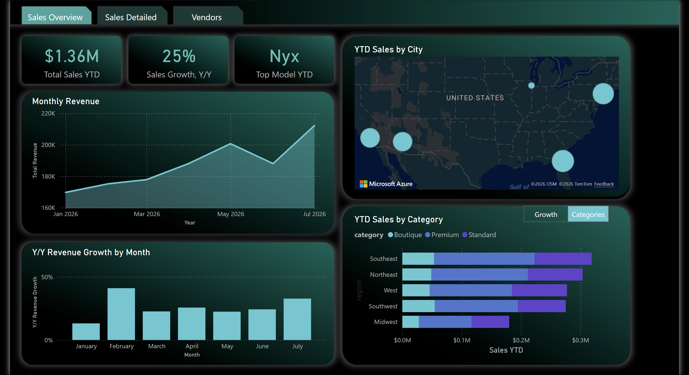
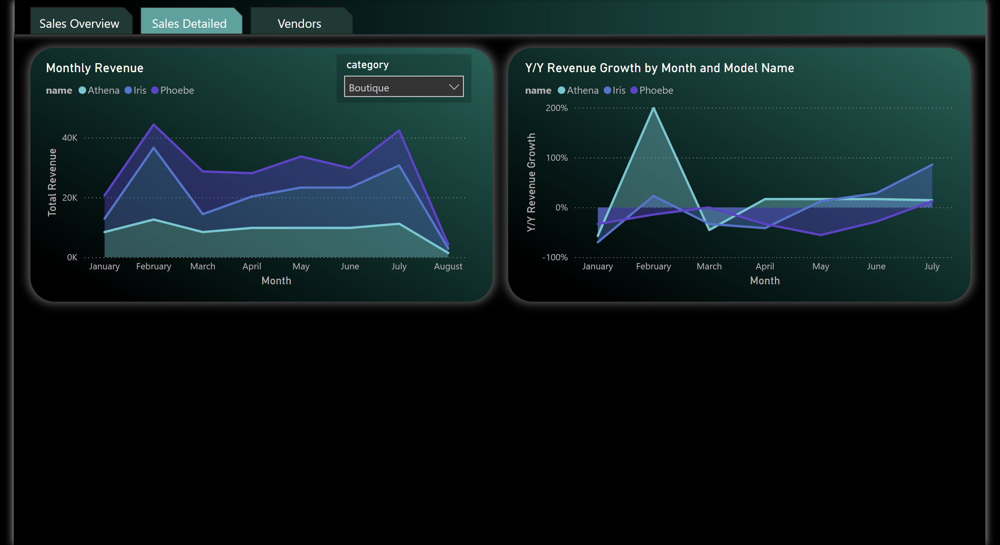
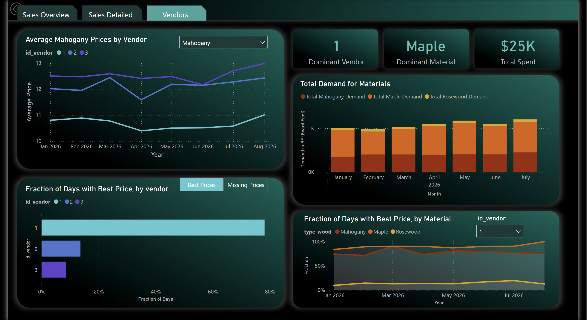
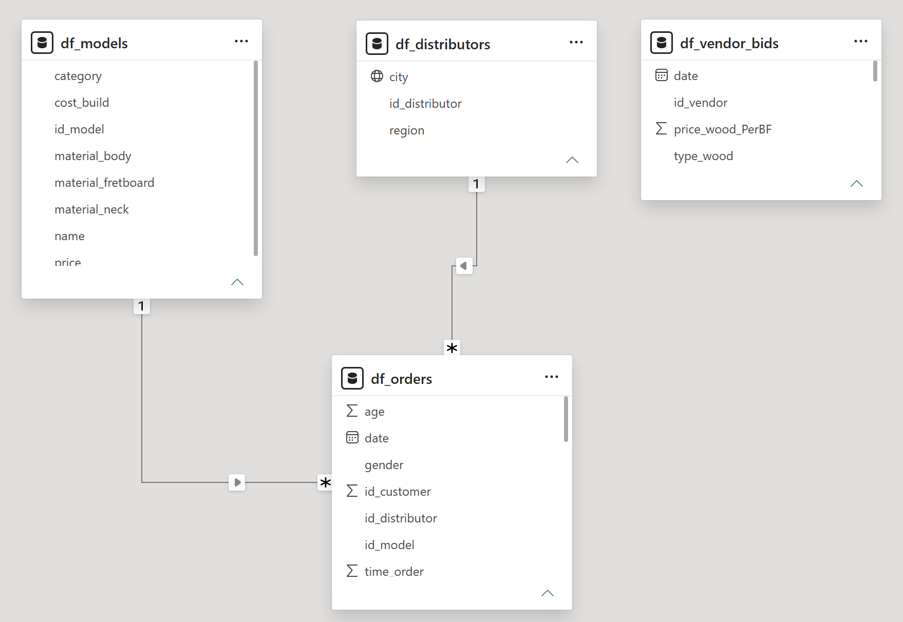

# Business Scenario

A guitar company needs a comprehensive dashboard to track its product sales. It uses several sellers (a.k.a. distributors) around the country who each are responsible for recording sales in an electronic system. Unfortunately, the sellers sometimes make mistakes when inputting sales into the database, resulting in data quality issues (missing fields, mistyped values, etc.). The company needs a dashboard that automatically cleans and visualizes the messy sales data, which updates daily. It also needs to track its use of different wood types over time and to compare price quotes of different wood vendors.

The dashboard should have three tabs:
- "Sales Overview": includes high-level insights such as monthly growth rates, top sellers, and the year-to-date product mix.
- "Sales Detailed": explores a specific category (e.g. standard, premium, etc.) and shows monthly sales and growth rates for each product within.
- "Vendors": calculates total demand for different wood types and compares relative affordability of the company's wood vendors.  

# Relevant Tables

This dashboard uses four tables: two are fact tables, and two are dimensional tables.

Fact tables:
- "df_orders": contains the messy data corresponding to customer orders. It updates daily.
- "df_vendor_bids": contains the price quotes that each wood vendor provides for every wood type. It also updates daily.

Dimension tables:
- "df_models": contains information about each guitar model, including the name, price, and the wood types it uses.
- "df_distributors": contains the location of each authorized seller.

# Data Cleaning

Each sale has an ID that corresponds to a specific seller (id_distributor). This column should be an integer between 1 and 5, but it is often input with typos. For example, when the value should be an integer (e.g. 4), it may be input as “44 “, “4!”, “-4”, ”4a4”, “6”, and “45.” The cleaning script is built so that everything except the last two cases is recorded as a single integer. The “6” case should fail because it exceeds the valid maximum value. The “45” case should fail because it is ambiguous (we can’t tell if the person who entered the sale meant to submit 4 or 5).

Here are the steps:

- Ensure the entry is converted to text, and strip any leading or trailing spaces.
- Try to convert to an integer. If unable, record as null.
- Find how many unique digits are in the entry. If more than one, record as null.
- If only one unique digit, save it and compare it to the maximum value.
  - If it exceeds it, record as null.
  - If not, record that digit as an integer.

A similar process is used to clean id_model, which should be an integer between 1 and 9. Since both columns require a similar cleaning process, the query includes a reusable function called “CleanID.”

# Architecture

Messy API --> Power Query --> Star Schema --> DAX --> Dashboard

The API is a full-stack web application that I deployed using Railway. The tech stack includes Python, SQLite, Docker, FastAPI, and GitHub Actions (which runs daily jobs). This application uses the principles of “continuous development.” It is connected to a specific branch of a GitHub [repo](https://github.com/datacookbooks/GuitarDataMessyAPI/tree/railway-revival); when I commit changes to that branch, the application automatically updates. This repo contains a Python script that generates new data every day.

# Screenshots

